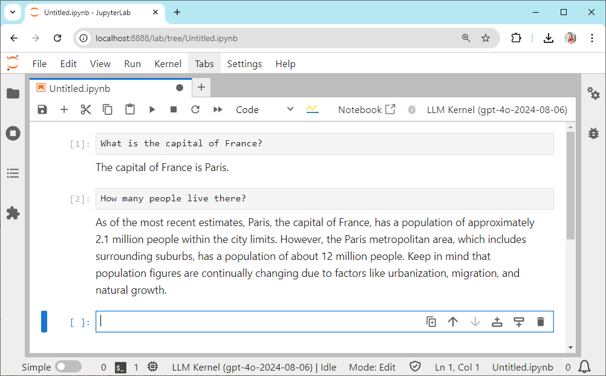
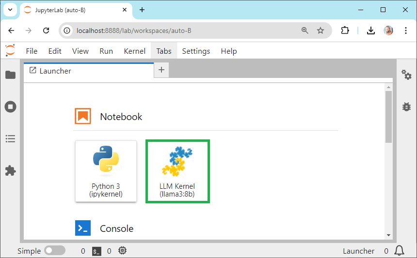

# ipy-llm-kernel

ipy-llm-kernel is a Jupyter kernel that allows you to type in English language and receive responses from a large language model (LLM).



It can make use of [OpenAI's chatGPT](https://openai.com/blog/openai-api), [Anthropic's Claude](https://www.anthropic.com/api), [Helmholtz' blablador](https://helmholtz-blablador.fz-juelich.de/) and [Ollama](https://ollama.com). 
You need an OpenAI API, Anthropic, Google or a Helmholtz account to use it.
Using it with Ollama is free but requires running an Ollama server locally.

> [!CAUTION]
> When using the OpenAI, Google Gemini, Anthropic or any other endpoint via BiA-Bob, you are bound to the terms of service 
> of the respective companies or organizations.
> The prompts you enter are transferred to their servers and may be processed and stored there. 
> Make sure to not submit any sensitive, confidential or personal data. Also using these services may cost money.

## Usage

After starting `jupyter lab`, select the LLM Kernel.



You can then type in English language and receive responses from the LLM as demonstrated above


## Installation

First, you should also create an environment variable named "IPY_LLM_KERNEL_MODEL" and enter a model name depending on which service provider you want to use. Examples:
* `llama3:8b`
* `blablador:alias:large`
* `claude-3-5-sonnet-20240620`
* `gpt-4o-2024-08-06`

Then, start a new terminal to install `ipy-llm-kernel` using pip. It is recommended to install it into via conda/mamba environment. If you have never used conda before, please [read this guide first](https://biapol.github.io/blog/mara_lampert/getting_started_with_mambaforge_and_python/readme.html).  

```
pip install ipy-llm-kernel
```

Afterwards, run additionally this command:

```
python -m ipy_llm_kernel install
```

You can check if it's installed by printing out the list of installed kernels:

```
jupyter kernelspec list
```

And you can uninstall them using this command:

```
jupyter kernelspec uninstall llm-kernel
```

## Development

If you want to contribute to `ipy-llm-kernel`, you can install it in development mode like this:

```
git clone https://github.com/haesleinhuepf/ipy-llm-kernel.git
cd ipy-llm-kernel
pip install -e .
```

## Similar projects

There are similar projects:
* [jupyter-ai](https://github.com/jupyterlab/jupyter-ai)
* [chatGPT-jupyter-extension](https://github.com/jflam/chat-gpt-jupyter-extension)
* [chapyter](https://github.com/chapyter/chapyter/)

## Issues

If you encounter any problems or want to provide feedback or suggestions, please create an [issue](https://github.com/haesleinhuepf/ipy-llm-kernel/issues) along with a detailed description and tag @haesleinhuepf .


